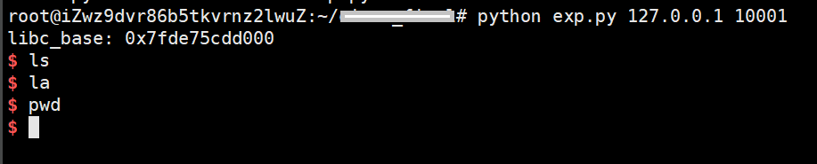
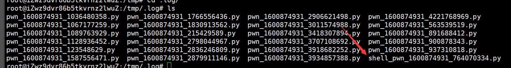
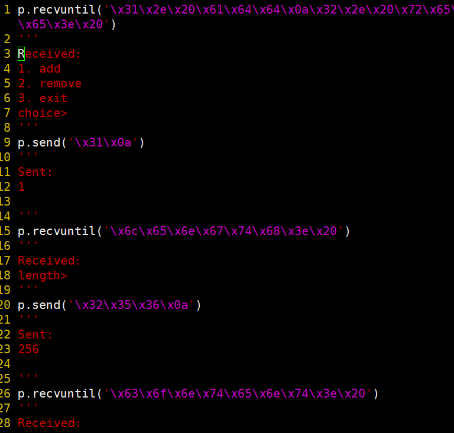

# awd-general-defense
传统AWD二进制通防，没有经过任何实战测试，不保证稳定性，也不建议正式比赛使用，仅作研究（

## 使用
```c
/**********config************/
#define BIN_PATH "/tmp/pwn"	// 原题目文件移动到此处
#define BIN_NAME "pwn"		// 题目命名 用于log文件
#define BUF_SIZE 0x2000

int enable_send_filter	= 0;	// 开启转发过滤，简单敏感字段匹配，可以不用开启
int enable_recv_filter	= 0;	// 开启转发过滤，简单敏感字段匹配，可以不用开启
int enable_shell_filter = 1;	// 若发现getshell，将过滤shell_list列表内容，推荐开启
char* recv_filter_list[] = {"\x7f", "\x55", "\x80"};	//过滤词
char* send_filter_list[] = {"\x7f", "\x55", "\x80"};	//过滤词
char* shell_list[]	= {"whoami", "ls", "cat ", "cd ", "curl ", "vim", "echo "};
// normal_list 需要尽可能包含程序运行中所能够打印的单词（白名单），用于判定当前程序是否正常运行，检测getshell
char* normal_list[]	= {"name", "show", "add", "remove", "choice", "content", "done", "length", "bye"};
/****************************/
```
1. 修改BIN_PATH，**并将原题目文件移动至BIN_PATH处**
2. 修改BIN_NAME为题目名，用于区分log文件
3. 开启或关闭filter（0-关闭 1-开启）
  - send: 指向题目程序发送的数据
  - recv：指从题目程序接受的响应
4. enable_shell_filter: 当通防识别到题目被getshell后，将对shell命令进行过滤
5. 可自定义需要过滤的敏感字符串（recv_filter_list、send_filter_list、shell_list）
6. **normal_list**: 根据不同题目程序，将程序能够打印的字符串尽可能填入该白名单（程序的每种输出，至少有一个词存在于白名单），这将用于识别是否被getshell
7. 编译 `gcc defense.c -o defense -pthread -std=c99`
8. **将defense移动至原题目文件处**

## 功能
1. 对send或recv的数据进行过滤，检测敏感字符串（enable_send_filter，enable_recv_filter）
2. 检测是否被成功getshell，当检测到getshell后可对shell命令进行过滤（enable_shell_filter）
  
3. 记录流量，并将流量保存为pwntools编程的样式，并对getshell的流量进行标记
  
  
